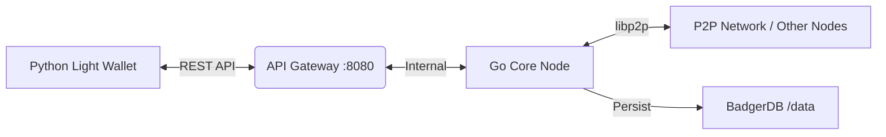

# SOLE Blockchain ☀️


> **SOLE** is a lightweight, academic Proof-of-Authority (PoA) blockchain written in **Go**. It powers the **Unisalento** digital token ecosystem, serving as a robust case study for distributed ledger technology.

---

## 🏗 Architecture

The ecosystem follows a decoupled architecture separating the Core Node from client interfaces.



## 🚀 Quick Start

Get your node running in seconds.

### 1. Build
```bash
go build -o sole-cli .
```

### 2. Initialize
Creates the blockchain genesis state in `./data/blocks`.
```bash
./sole-cli init
```

### 3. Run
Starts the P2P node and API Gateway.
```bash
# Start Node (P2P: 3000, API: 8080)
./sole-cli startnode --port 3000 --api-port 8080
```

---

## 🌟 Key Features

*   **Consensus Core**: **Proof of Authority (PoA)** engine using ECDSA signatures. No energy-intensive mining; only authorized validators can forge blocks.
*   **Storage**: **BadgerDB v3** persistent storage (`/data`). Configured with `Truncate: true` for crash recovery and memory optimization.
*   **Networking**: Optimized **P2P Discovery** via `libp2p` (mDNS/DHT). Includes "Self-Dialing" filtering and robust handshake deduplication.
*   **Reliability**: **Graceful Shutdown** capability. Handles `SIGINT` (CTRL+C) to safely close connections and release DB locks.
*   **Ecosystem**: Integrated **REST API** (`/tx/send`, `/balance`) enabling external integrations (e.g., Python/Web UIs).

---

## 📚 Documentation

*   **[API Reference](docs/api_reference.md)**: Endpoints for developers.
*   **[CLI Manual](docs/cli_manual.md)**: Command flags and utility tools.

---

> **⚠️ ACADEMIC PROJECT**
> This software is a Proof of Concept (PoC) developed for educational and research purposes at the **University of Salento**. It is not intended for production financial use.