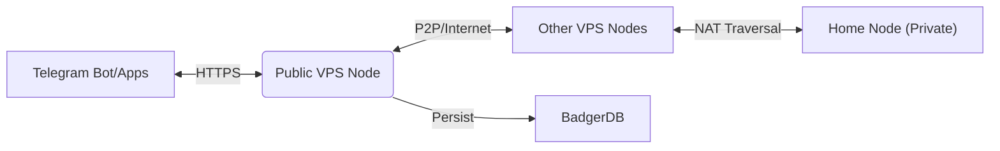

# SOLE Blockchain ☀️

> **SOLE** is a lightweight, academic Proof-of-Authority (PoA) blockchain written in **Go**. It powers the **Unisalento** digital token ecosystem, serving as a robust case study for distributed ledger technology.

---

## 🏗 Architecture

The ecosystem follows a decoupled, **Hybrid Network** architecture:
*   **Public VPS Nodes**: Acts as Bootnodes and API Gateways (Always Online).
*   **Home/Private Nodes**: Connect via NAT Traversal and participate in validation.

## 🚀 Quick Start

### Local Development
Get your node running locally in seconds.

1.  **Build**: `go build -o sole-cli .`
2.  **Initialize**: `./sole-cli init`
3.  **Run**: `./sole-cli startnode`

---

## 🌟 Key Features

*   **Consensus Core**: **Proof of Authority (PoA)** engine using ECDSA. Energy-efficient validation.
*   **Public P2P Network**: Full Internet support with **DNS Discovery** and **NAT Traversal**.
*   **Secure API**: Built-in support for **HTTPS/TLS** (via Reverse Proxy) and Rate Limiting.
*   **Reliability**: **Graceful Shutdown**, BadgerDB v3 persistence, and Systemd integration.
*   **Ecosystem**: Full support for custodial apps like the **Telegram Bot**.

---

## 📚 Documentation

*   **[Ecosystem & Clients](docs/ECOSYSTEM.md)**: Wallet Manager & Integrations.
*   **[API Reference](docs/api_reference.md)**: Endpoints for developers.
*   **[CLI Manual](docs/cli_manual.md)**: Command flags usage.

---

> **⚠️ ACADEMIC PROJECT**
> This software is a Proof of Concept (PoC) developed for educational and research purposes at the **University of Salento**. It is not intended for production financial use.
