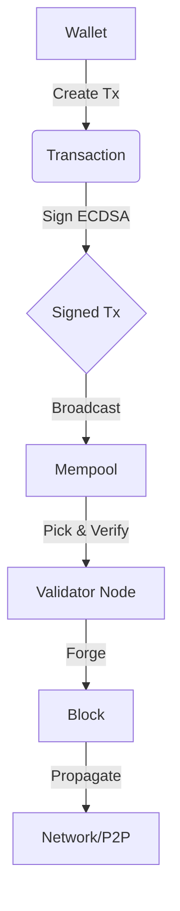

# SOLE Blockchain Technical Whitepaper

## 1. Abstract
SOLE (SLN) is an educational blockchain developed for the University of Salento. It implements a Proof of Authority (PoA) consensus mechanism designed for controlled, low-energy environments. This document details the technical architecture, including the UTXO model, cryptographic primitives, P2P networking, and persistence layer.

## 2. Cryptographic Specifications
SOLE leverages standard cryptographic primitives to ensuring security and integrity.

*   **Elliptic Curve**: NIST P-256 (secp256r1).
*   **Signature Scheme**: ECDSA (Elliptic Curve Digital Signature Algorithm).
*   **Hash Function**: SHA-256 (Double-SHA-256 for Block Hashing).
*   **Address Generation**: Base58Check encoding of Versioned RIPEMD-160 hashes.
    *   Algorithm: `Base58Check(Version + RIPEMD160(SHA256(PublicKey)))`

## 3. Consensus Mechanism: Proof of Authority (PoA)
Unlike Proof of Work (PoW), SOLE uses PoA to achieve high throughput with negligible energy consumption.

### 3.1 Validator Authority
*   **Hardcoded Genesis**: The Genesis Block (Height 0) anchors the network configuration and assigns initial admin privileges.
*   **Authorized Validators**: A static list of public keys (Hex format) embedded in the protocol (`consensus.go`) determines who can forge blocks.
    *   *Implementation Note*: To add a validator, the source code must be updated with the new validator's public key and the node binaries re-distributed.

### 3.2 Forging Process
Validators do not "mine" hashes. Instead, they:
1.  Collect transactions from the Mempool.
2.  Validate inputs against the UTXO set.
3.  Construct a block.
4.  **Sign** the block hash with their ECDSA Private Key.
5.  Broadcast the signed block.
    *   Nodes verify the signature against the `AuthorizedValidators` list before accepting the block.

## 4. Data Model
### 4.1 Transaction Model (UTXO)
SOLE uses the Unspent Transaction Output (UTXO) model, similar to Bitcoin.
*   **TxInput**: References a previous output (TxID, Index) and provides a Signature (Unlock Script).
*   **TxOutput**: Specifes an amount and a locking script (PubKeyHash).
*   **Balance**: Calculated by scanning all UTXOs lockable by a user's key.

### 4.2 Block Structure
```go
type Block struct {
    Timestamp     int64
    Transactions  []*Transaction
    PrevBlockHash []byte
    Hash          []byte
    Height        int
    Validator     []byte // Public Key of forging validator
    Signature     []byte // ECDSA Signature of the block hash
}
```

### 4.3 Transaction Lifecycle


## 5. Persistence Layer
Data is persisted using **BadgerDB**, a fast key-value store optimized for SSDs.
*   **Optimization**: SOLE is tuned for low-memory environments (IoT/RPi4 clusters).
    *   `ValueLogFileSize`: 16MB
    *   `MemTableSize`: 8MB
    *   `BlockCacheSize`: 1MB

## 6. Networking (P2P)
Built on **libp2p**, the networking layer ensures decentralized peer discovery and synchronization.

### 6.1 Discovery
*   **mDNS**: Local peer discovery for campus LAN environments.
*   **DHT (Kademlia)**: Distributed Hash Table for wider network peer routing.

### 6.2 Protocol
Custom binary protocol running on `/sole/1.0.0` streams:
*   `version`: Handshake and block height exchange.
*   `addr`: Peer exchange.
*   `block`: Block propagation.
*   `inv`: Inventory announcements (new blocks/txs).
*   `getdata`: Requesting specific object payloads.
